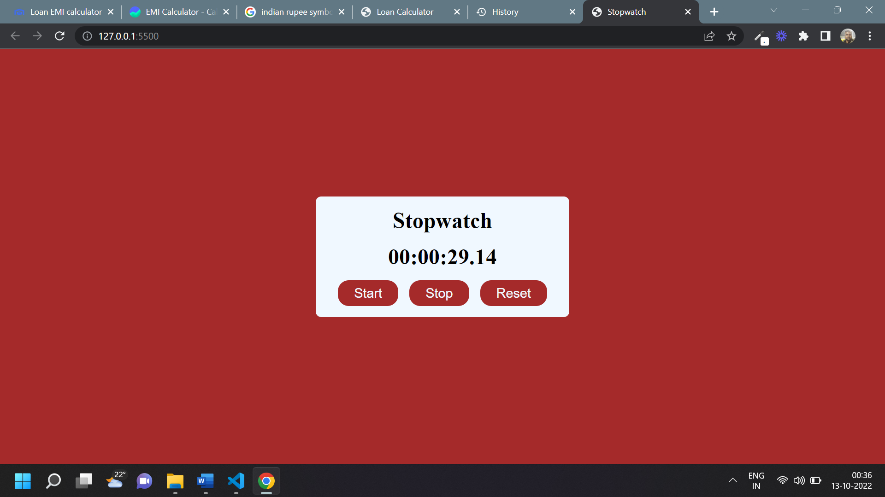

# Javascript Assignment Stopwatch

## Stopwatch [Live Link](https://name-conversion-js.netlify.app/)

- Skills Gained in this project

  - use the set intervel and clear intervel function

  - use padstart string function

---

## Time taken to finish this project

- 1 hr 30 to complete it

#### Screenshot

